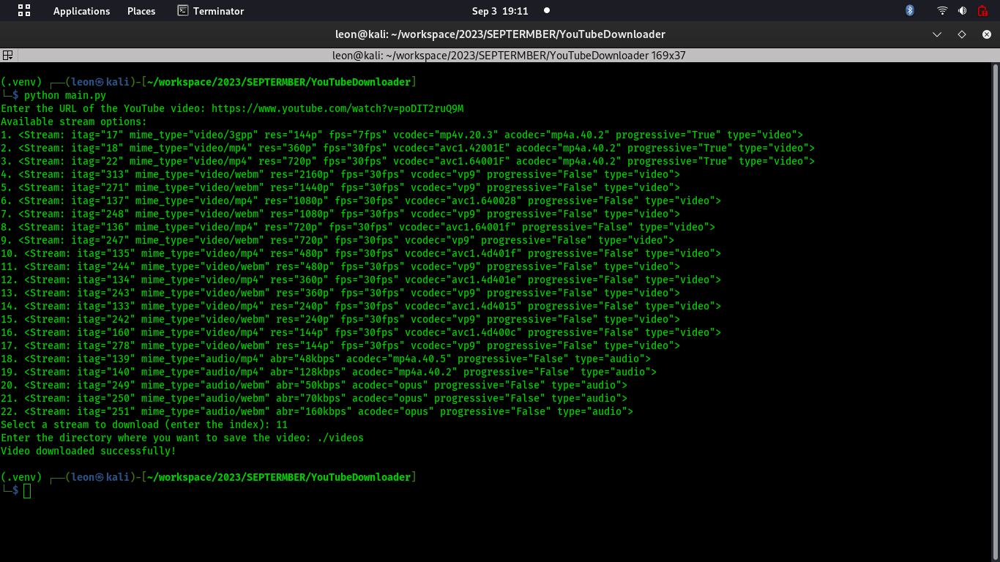
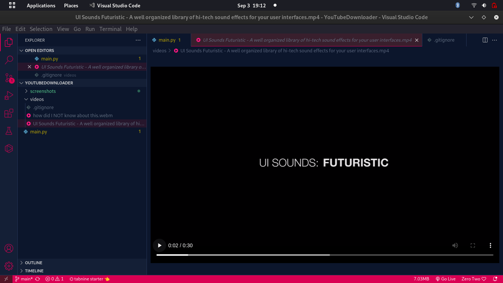

# YOUTUBEVIDDOWNLOADER




A Python script that allows you to download YouTube videos using the `pytube` library.


## Table of Contents
- [Installation](#installation)
- [Usage](#usage)
- [Author](#Author)


## Installation

1. Clone the repository to your local machine:
```bash
git clone git@github.com:leonTech254/YOUTUBEVIDDOWNLOADER.git
```
3. Navigate to the repository
```bash
cd YOUTUBEVIDDOWNLOADER
```
4. Install the required dependencies using pip
```bash
pip install pytube
```

## Usage
1. Run the script:

```bash
python3 main.py
```

## Author

- Name:Leon Martin
- Email:martinleontech23@gmail.com


